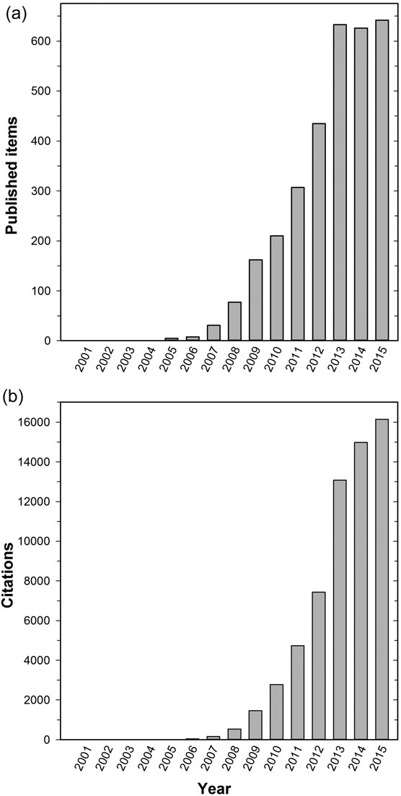

```{=tex}
\fontsize{12}{26}
\selectfont{}
```
```{r setup, eval=FALSE, echo = FALSE, warning = FALSE, message = FALSE}
knitr::opts_chunk$set(collapse = TRUE, comment = "  ", fig.align = 'center', cache=FALSE)
library(knitr)
library(tidyverse)
```

## 1. INTRODUCCION

\quad

Durante las últimas dos décadas, la disciplina de la oceanografía ha sido testigo abuntante información respecto a la importancia de los procesos químicos y su impacto en los distintos niveles de organización biológica que existen en ecosistemas marinos, y a su vez, como estos procesos han sido perturbados y acrecentados por la acción del hombre a través de la emisión de gases de efecto invernadero en un contexto de Cambio Clímatico [@Cook2013b]. La Acidificación de los Océanos (AO) se ha convertido en un tópico que ha despertado el interés de investigadores de todo el mundo (Figura 1) y Chile no ha sido la excepción. 

En términos prácticos, la AO implica una reducción del pH del agua de mar (aumento concentración de iones de hidrógeno), actualmente causada por un aumento dióxido de carbono (${CO}_{2}$) en la atmósfera. Asociado Los cambios químicos incluyen una mayor concentración de iones de bicarbonato y carbono inorgánico disuelto y una disminución concentración de iones de carbonato en el océano [@Williamson2021]. Aunque la química del sistema de carbonato está bien documentada y comprendida, la investigación sobre la biología e implicaciones ecológicas de la AO antropogénica comenzó de forma potente y en serio hace unos 20 años [@Gattuso2011].

```{r echo=FALSE, out.width = "60%", fig.align='center', fig.cap= "Crecimiento de citas y estudios relativos a la Acidificación de los Océanos en el mundo"}

```

Esta investigación dice que una amplia gama de organismos marinos, incluido el fitoplancton, invertebrados y peces, sintetizan alguna forma de carbonato de calcio en sus estructuras. Las más llamativas de estas estructuras son los esqueletos de corales, conchas de moluscos, cocolitóforos y exoesqueletos de crustáceos. Varios estudios predicen que la química del agua de mar no solo disminuirá formación de carbonato de calcio (${CaCO}_{3}^{-2}$) en muchas organismos, sino también se acelerará su disolución y/o erosión [@Manriquez2013]. Una amplia gama de posibles consecuencias han sido identificados desde entonces, con lucidez sobre la diversa vulnerabilidad de las especies de organismos marinos. 

En este sentido se han comprobado los efectos sobre los océanos, ecosistemas y organismos de formar profusa. Sin embargo, y como toda ciencia que madura en su transitar, durante el último tiempo este *"main topic"* ha tenido detractores que han objetado desde los datos, métodos y experimentos que los han llevado a sus grandilocuentes conclusiones. Este ensayo tiene como objetivo revisar parte de los demostrados efectos del AO en las especies marinas, así como también las legítimas dudas sobre la replicabilidad de los experimentos realizados, los cuales han generado suspicacias en los últimos años. como objetivo ulterior, se realizan reflexiones epistemologicas sobre la ciencia misma, sus fortalezas y debilidades, las cuales pueden ser muy útiles en el contexto de la AO.

\pagebreak

## 2. CUERPO

Respecto a las investigaciones acumuladas en los últimos años, existe en Chile un cuerpo científico maduro que ha trabajado en esta línea con profusos resultados en especies del medio marino. Todos estos trabajos se han centrado en especies que generan estructuras calcareas corporales, como copépodos y moluscos. @Aguilera2016 encontraron que los cambios en el pH producido por las descargas de los ríos pueden producir respuestas en el fenótipo del copépodo nerítico *Acartia tonsa* frente a cambios en la química marina asociada a la AO. La variabilidad adaptativa fue un factor determinante de las respuestas de los copépodos. Este experimento permitió que estos copépodos toleraran una mayor exposición a niveles altos de $_PCO^2$, ya que sus tasas de ingestión fueron en promedio 43% superiores a las de los organismos costeros. Sin embargo, uno de los mayores hallazgos fue identificar que la adaptación a las fluctuaciones locales en el pH del agua de mar desempeña un papel importante en la respuesta de las poblaciones planctónicas a las condiciones asociadas a la AO.

@Vargas2017 realizaron sus análisis sobre distintos tipos de poblaciones marinas como copépodos, mitílidos y gastrópodos. En ellos, encontraron que los factores de estrés global, entre ellos, la la AO, constituyen un problema importante y de rápida influencia para este tipo de organismos, asi como también su en el funcionamiento de los servicios de ecosistémicos. Este análisis fue realizado en el ecosistema costero del Sistema de la Corriente de Humboldt (HCS) frente a Chile, el cual alberga un amplio gradiente físico-químico latitudinal y temporal con considerable irregularidad en las condiciones oceanográficas locales. Esta heterogeneidad puede, a su vez, modular las tolerancias específicas de los organismos al estrés climático en especies con poblaciones distribuidos a lo largo de este gradiente ambiental. En el estudio observaron relaciones de respuesta negativas en modelos de especies expuestos a cambios en la presión parcial de ${CO}_{2}$ ($_PCO^2$). finalmente los autores proponen el uso de un índice simple teniendo en cuenta la variabilidad natural de $_PCO^2$ a lo largo de los ecosistemas para una mejor interpretación de las posibles consecuencias de la AO sobre las especies que habitan en ecosistemas costeros variables.

@Jahnsen-Guzman2021 probaron la capacidad de las especies para resistir variaciones de las condiciones químicas del océano en un contexto de cambio. Estas variaciones fueron consignadas en los sistemas estuarinos y la estraficación vertical de la columna del agua, que puede crear "refugios ambientales" o distintas capas de agua con condiciones que favorecen la aptitud de algunos individuos de la especie de chorito chileno. La salinidad, el estado de saturación y los contenidos de ${CO}_{3}$ en el agua de mar fueron algunos de los factores que mejor explicaron las diferencias entre las dos capas. En tales condiciones ambientales, las características de esta especie que respondieron a tal variación fueron las tasas de crecimiento y calcificación, con valores significativamente más altos a 4 m de profundidad, mientras que lo contrario, el estrés metabólico aumentado, fue mayor en los choritos criados y trasplantados a la superficie (1 m). Tales diferencias apoyan la noción de un refugio ambiental, donde especies como los choritos pueden encontrar mejores condiciones de crecimiento y lograr mayores niveles de rendimiento. Estos resultados son relevantes considerando la importancia de *M. chilensis* como recurso para la acuicultura y como especie formadora de hábitat. Además, estos resultados arrojan luces sobre las respuestas variables exhibidas por los organismos estuarinos a los cambios de pequeña escala en las características de la columna de agua, lo que a su vez ayudará a comprender mejor las respuestas de los organismos a los escenarios proyectados de cambio climático global.

@Yevenes2019 investigaron los efectos a mediano y largo plazo de la entrada de variables biogeoquímicas en el Fiordo Reloncaví (41º40'S; 72º23'O) como resultado de la erupción del volcán Calbuco. Este ecosistema soporta una mayores producciones de cultivo de mitilidos de la patagonia Norte. Se testearon los impactos de los cambios fisicoquímicos en la columna de agua sobre los juveniles del chorito chileno *Mytilus chilensis*. Después de la erupción, un gran bloom de fitoplancton generó un aumento en pH, y con ello un aumento de la acificación del estuario. Los resultados sugieren un impacto localizado de la erupción volcánica en la superficie del sistema de fiordos, y efectos a corto plazo en el sistema de carbonatos y en las estructuras calcareas del chorito cultivado. Este estudio contribuye a mejorar las estrategias de adaptación climática por parte de la industria acuícola de choritos para enfrentar la AO y cambios en las condiciones de escorrentía del sistema de fiordos en donde estos se cultivan.

El loco *Concholepas concholepas* es uno de los recursos económicos y sociales mas importante de Chile. @Manriquez2013 estudiaron como el OA también puede influir en otros procesos biológicos clave, como la supervivencia, el crecimiento y comportamiento de este tipo de organismos. Estudiaron el impacto de la AO en la capacidad de recuperar la posición despues del desalojo por motivo del oleaje. Este comportamiento fue investigado bajo distintos niveles de $_PCO^2$. Estos resultados sugieren que la capacidad de volver a su posición en la ontogenia temprana de *C. concholepas* será afectada positivamente por los niveles de $_PCO^2$ esperados para finales del siglo XXI y principios del próximo. Junto a la evaluación del impacto de la AO en organismos, @Vargas2017 y @Perez2015 estudiaron la influencia de descargas de glaciares y ríos y como ello afecta a los ciclos biogeoquímicos aportando carbono y nutrientes, y por ende alterando la acidez de los sistemas.

De acuerdo con lo expuesto, es posible entender y comprobar el efecto de la acidicifación del medio marino sobre organismos con estructuras calcareas y su efectos. Sin embargo, algunos investigadores fueron peligrosamente mas allá. Durante el inicio del siglo XXI, un grupo de científicos liderados por Philip Munday (coautor de mas de 250 articulos del tema[^1]) abrieron un flanco relativo a los efectos de la cambiante química de los océanos en los peces, afectando desde su fisiología, reproducción y comportamiento. En unos de sus mas connotados trabajos [@Munday2013] probaron el efecto de los niveles de CO2 en un futuro cercano (490, 570, 700 y 960 de $_PCO^2$) (Figura 2) en las respuestas olfativas y niveles de actividad de juveniles de trucha de coral, *Plectropomus leopardus*, un pez de arrecife piscívoro que también es una de las especies pesqueras más importantes en la Gran Barrera de Arrecife Australiana. De acuerdo a este experimeto en mesocosmo, el animal mostró un deterioro del comportamiento si la $_PCO^2$ se mantiene en niveles más altos, y conllevaría impactos significativos en desempeño del juvenil de la trucha, y por consiguiente, es probable que afecte la supervivencia y sus presupuestos energéticos, con consecuencias incluso para las interacciones predador-presa y pesquerías comerciales.

[^1]: <https://researchonline.jcu.edu.au/view/jcu/B75BF971396A6653D2DCC47B11EB5981.html>

```{r echo=FALSE, out.width = "100%", fig.align='center', fig.cap= "Comportamiento y niveles de actividad de trucha coralina despues de 28 días de exposición a distintos niveles de CO2 (Ex. Munday et al.2013"}
knitr::include_graphics("images/Fig2.pdf")
```


En otro de los hallazgos del grupo liderado por Munday, [@Miller2013] predicen que la acidificación de los océanos tendrá un impacto negativo en la reproducción de muchas especies marinas, ya sea al reducir el éxito de la fertilización o al desviar la energía del esfuerzo reproductivo. En este estudio hicieron los experimentos en estadios larvarios y juveniles del pez payaso canela, *Amphiprion melanopus*, de la Gran Barrera de Coral Australiana. En este análisis, los autores proporcionan la primera evidencia de los efectos potenciales de la acidificación del océano en los atributos reproductivos claves de los peces marinos y demuestra un efecto estimulante en respuesta al aumento de $_PCO^2$.

Junto a estos experimentos, se presentaron cerca de un centenar mas de la misma índole[^1] en un lapso de 15 años. El principal foco de investigaciòn del equipo liderado por Munday, tenía como intención acumular evidencia del efecto del aumento del nivel de ${CO}_{2}$ en el medio marino, demostrando una serie de efectos sorprendentes en el comportamiento de los peces, como hacerlos más audaces y dirigirlos hacia los productos químicos producidos por sus depredadores. Este tipo de descubrimientos alcanzaron fama mundial y fueron cubiertos por los mas prestigiosos medios internacionales[^2]. Estas conclusiones llegaron incluso al informe de 2014 del Grupo Intergubernamental de Expertos sobre el Cambio Climático [@IPCC2014], advirtiendo los riesgos y las "profundas consecuencias para la diversidad marina y las pesquerías asociadas".


[^2]: <https://www.scientificamerican.com/article/ocean-acidification-can-m/>

Pero cuando la ciencia se avanza, crece y se acumula a pasos agigantados y alcanza grandes estos niveles de notoriedad, ella también queda bajo el escrutinio público con mayor fuerza y poder de fiscalización, como fue el caso de este grupo y su foco de investigación. Analizando los resultados del grupo de Munday, un grupo de investigadores liderados por @Clark2020, trató de replicar los experimentos anteriormente citados y no lograron reproducir los resultados. Ellos establecieron que existían problemas importantes considerados como *"debilidades metodológicas o analíticas"* que podrían haber llevado a resultados irreproducibles. Cabe señalar que el grupo de Clark tiene un interés declarado por la ciencia desprolija y el fraude científico. En el artículo, @Clark2020 insinuaron incluso la elaboración de malas conductas científicas. La prueba de replicabilidad es una de las bases de la investigación moderna y es la forma en que la comunidad se desafía a sí misma como un mecanismo para combatir la subjetividad. La premisa de la replicabilidad es que la comunidad científica puede corregir estos defectos. 

Esta situación desencadenó largas disputas a la cual se sumaron otros investigadores que fueron llamados a reevaluar los trabajos de Munday. Estos identificaron los mismos problemas de reproducibilidad y corroboraron lo descrito por @Clark2020. Mas allá de esta disputa científica, esto provocó un remezón en la investigación relativa a los impactos de la AO en los ecosistemas marinos, estableciendo un manto de duda sobre ella, generando con ello un escepticismo en la comunidad científica internacional. Este tipo de controversias y revisión de los procesos científicos tiene raíz en un aspecto mas profundo y filosófico que se ha tratado de explicar mediante las bases conceptuales de la epistemología.

Existe un fenomeno relacionado a la psicología humana y que está ocurriendo en una amplia gama de campos científicos, desde la psicología hasta la ecología, y podría ser descrito y conceptualizado con el nombre de *decline effect* o *efecto de rechazo* [@Lehrer2010]. Algunos efectos muy comprobados comienzan a disminuir cuando se someten a repetición de sus pruebas. @Schooler2011a plantea que muchos efectos descubiertos científicamente publicados en la literatura parecen disminuir con el tiempo. Apodado el *efecto de rechazo*, esta desconcertante anomalía se descubrió por primera vez en la década de 1930 en la investigación en parapsicología, en la que la significación estadística de la supuesta evidencia de la capacidad psíquica disminuyó a medida que se repetían los estudios [@Schooler2011a].

Las explicaciones de este efecto incluyen la regresión a la media que invisibiliza los detalles del cuerpo científico. Es más probable que se informen resultados tempranos cuando los errores se combinan para magnificar el efecto aparente, entonces los estudios publicados mostrarán un sesgo sistemático hacia hallazgos inicialmente exagerados, que posteriormente se autocorrigen estadísticamente. Otro aspecto mas atingente con el asunto de este ensayo dice relación con el sesgo de publicación. Esto señala que es posible que los investigadores solo puedan publicar hallazgos iniciales sobre un efecto cuando es especialmente grande y esperado que así ocurra, mientras que los estudios que lo secudan y que presentan aspectos menos conspicuos podrían ser capaces de reportar efectos más pequeños. 

Por otro lado, muchos investigadores, como el grupo de Munday, trabajan con un sesgo en el cual buscan encontrar qué resultados quieren, y eso puede influir en los resultados  e incurrir en errores y desproligidad al momento de establecer sus experimentos. Esta situación a su vez entorpece la replicabilidad de la ciencia. La acumulación de evidencia científica para corroborar los hallazgos que están de moda o concitan gran aceptación  del a comunidad ha sido descrito con lucidez por Thomas Khun como *"ciencia normal"*. Sin embargo, la acumulación del conocimiento en cualquier tòpico puede comenzar a parecer cada vez más incierto, y con ripios, que fue lo que aconteció con los hallazgos relativos al impacto del AO sobre el comportamiento de peces tropicales.

En este sentido, es posible comprender que la profusa evidencia que había respecto a los efectos del AO sobre los ecosistemas marinos y que se estaba acumulando durante las dos últimas décadas, ocultaron otros estudios con resultados negativos. Por lo tanto, fue muy complejo *"nadar contra la corriente"* y publicar resultados que promovieran cuestionamientos a la corriente principal. Sin embargo, y como todo proceso de conocimiento científico, existen también, a veces muy ocultas, pequeñas señales que pueden iluminar el camino desde otra perspectiva y generar los cambios de paradigma, que son, a fin de cuentas, los procesos cognitivos que perfeccionan el progreso del conocimiento científico.


\pagebreak

## 3. DISCUSION


El cambio climático no es lineal en sus impactos, pero sus resultados influyen en la ciclicidad normal de los patrones climáticos que afectan a la naturaleza y a los ecosistemas allí contenidos. Uno de los mas significativos impactos tiene relación con la Acidificación de los Océanos. Este fenomeno de causas antropogénicas esta descrito como el proceso en el cual el océano absorbe cantidades significativas de ${CO}_{2}$ de la atmósfera. Las concentraciones de ${CO}_{2}$ atmosférico siguen aumentando como resultado de las actividades humanas, como el uso de combustibles fósiles y el cambio de uso de la tierra. En este proceso el océano juega un papel fundamental en la desaceleración de la tasa de cambio climático, absorbiendo alrededor del 30 % de las emisiones antropogénicas anuales [@LeQuere2016]. a pesar de este rol fundamental del océano, existe un desequilibrio previamente descrito entre los gases en el aire y en el agua, por lo tanto, el valor del pH del océano ha disminuido, es decir, el océano se acidifica cuando el agua reacciona con el ${CO}_{2}$. Esto trae como consecuencia que el agua ácida altera la capacidad de los organismos calcificados para para desarrollar sus procesos fisiológicos y biológicos de manera regular.

Con este contexto, el presente ensayo tuvo dos objetivos definidos. El primero dice relación con identificar y desplegar una serie de estudios que comprueban el impacto del AO sobre organismos marinos que son influidos directamente por los procesos quimicos derivados de los niveles del  ${CO}_{2}$ en el medio para formar las estructuras corporales, como son copépodos, mitílidos y gastrópodos. En este analisis no existe mayor cuestionaniento respecto a los hallazgos de los distintos autores nacionales e internacionales. El segundo objetivo, se desprende del primero, en donde se cuestiona la acumulación de conocimiento que arrastra este tópico y el cuerpo cientifico que trabaja en ello. En este aspecto, se cuestiona extender la ciencia asociada a la AO y sus efectos en el comportamiento y reproducción de peces tropicales. Este tipo de investigación acumuló profusa evidencia, pero tambien ha sido parte del ojo fiscalizador de la comunidad científica, y es ahí donde se identifican conductas no deseadas, las que tienen implicancias directas en los resultados y grandilocuentes conclusiones emanadas. 

Aquí se podría desprender un problema de información selectiva, la cual tiene sus raíces en un defecto cognitivo fundamental, que es que nos gusta demostrar que estamos bien y evitamos estar equivocados, y lo que es peor, no demostrar lo que nadie quiere escuchar. Estas conductas son los pequeños detalles que socaban la confianza que existe en la humanidad sobre el desarrollo de la ciencia.  El *efecto de rechazo* es preocupante porque nos recuerda lo difícil que es probar algo y que a su vez nos gusta fingir que nuestros experimentos definen la verdad para nosotros. 

Es por ello que, cada vez que un tema científico se vuelve importante y congrega adeptos y loas corroborando lo que todos quieren escuchar, es a veces necesario prestar atención a los detalles, dado que muchas veces *"el diablo está en los detalles"*...


\pagebreak

## 4. REFERENCIAS
